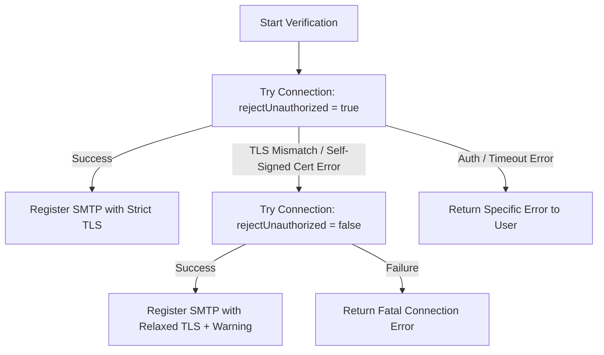

# SMTP Verification & TLS/SSL Handling Guide for SaaS Bulk Mailers

This guide details the configurations, best practices, and architecture required to robustly support custom SMTP connections (such as Zimbra, self-hosted, or IP-based servers) on a SaaS mass-mailing platform.

---

## 1. The Correct Nodemailer Configuration

When handling custom user SMTP inputs, certificates often fail validation due to:
- IP address used instead of hostname (domain altname mismatch).
- Self-signed certificates (common on internal Zimbra/corporate mail setups).
- Expired certificates.

The correct transport configuration relies on the `tls` options:

```javascript
const transporter = nodemailer.createTransport({
  host: '45.248.123.158', // Can be IP or Hostname
  port: 587,              // Port
  secure: false,          // true for 465, false for 25, 587, 2525
  auth: {
    user: 'smtp_username',
    pass: 'smtp_password'
  },
  tls: {
    // Crucial: Set to false to bypass certificate authority checks for mismatched altnames/self-signed certs
    rejectUnauthorized: false, 
    // Explicitly pass servername to help servers check host SNI alignment
    servername: '45.248.123.158'
  },
  connectionTimeout: 8000,
  greetingTimeout: 8000
});
```

---

## 2. Best Practices for TLS/SSL in SaaS

* **Try Strict First:** Always attempt to connect using `rejectUnauthorized: true`. Bypassing validation globally exposes users to Man-in-the-Middle (MitM) attacks. Only fall back when a TLS error is detected.
* **Granular Error Detection:** Inspect the error code and error message. Fallback to relaxed TLS verification only if the connection fails with TLS certificate validation issues (like `DEPTH_ZERO_SELF_SIGNED_CERT`, `ERR_TLS_CERT_ALTNAME_INVALID`).
* **Timeouts:** Restrict `connectionTimeout` and `greetingTimeout` to 8-10 seconds. Otherwise, broken SMTP hosts will freeze your node process threads.
* **Store TLS Preference:** Once a user SMTP host has successfully connected via relaxed TLS, save this choice (`rejectUnauthorized = false`) in your database so subsequent bulk dispatches don't waste time on initial failed handshakes.

---

## 3. Recommended Port & Security Combinations

| Port | Secure | Protocol / Authentication | Usage Scenario |
|---|---|---|---|
| **465** | `true` | **Implicit TLS (SMTPS)** | Secure connection established immediately before SMTP handshakes. Used by Gmail, Yahoo, etc. |
| **587** | `false` | **Explicit TLS (STARTTLS)** | Starts as cleartext and upgrades to TLS. Modern standard for client-to-server submissions. |
| **25** | `false` | Cleartext / STARTTLS | Server-to-server relaying. Often blocked by ISPs and cloud providers (AWS, GCP). |
| **2525** | `false` | Cleartext / STARTTLS | Alternative port to bypass ISP blocks. Common on Elastic Email, Mailgun, etc. |

---

## 4. Example SMTP Verification Flowchart

Here is how verification is orchestrated in production:



---

## 5. Production-Safe SaaS Architecture

For a bulk mailer platform, sending emails synchronously within HTTP requests will cause timeouts. You must adopt a distributed architecture:

1. **Queueing System:** Push mail campaigns into a distributed message queue (e.g., **BullMQ** or **RabbitMQ**) backed by Redis.
2. **Worker Nodes:** Dedicate background worker processes to consume jobs from the queue. This prevents web server crashes from stopping mail deliveries.
3. **Socket Pooling:** Enable Nodemailer socket pooling (`pool: true`) with configurable parameters:
   - `maxConnections`: Maximum parallel sockets open to the SMTP host (typically 3–5 to avoid being blacklisted by the recipient server).
   - `maxMessages`: Maximum messages to dispatch per socket before closing and recreating it.
4. **Throttling:** Implement rate-limiting per SMTP server. If Zimbra limits connections to 10/minute, your workers must delay dispatches accordingly.

---

## 6. How Commercial Bulk Mailers Handle Custom SMTPs

Commercial SaaS systems like Sendy, Maily, or customer engagement tools handle custom SMTP configurations using these strategies:

* **Optional TLS Bypass Toggle:** They provide a UI checkbox: *"Allow self-signed or invalid SSL certificates (insecure)"*. This gives users full control and avoids unexpected failures on custom hosts.
* **Auto-Discovery:** When the user enters an IP address or hostname, the system tries standard ports (465, 587, 2525) sequentially in the background to automatically identify working credentials.
* **Proxy Mail Tunnels:** For high-throughput requirements where custom SMTP servers are slow or reject high concurrency, platforms sometimes tunnel traffic through an egress proxy to maintain static IP reputation.
